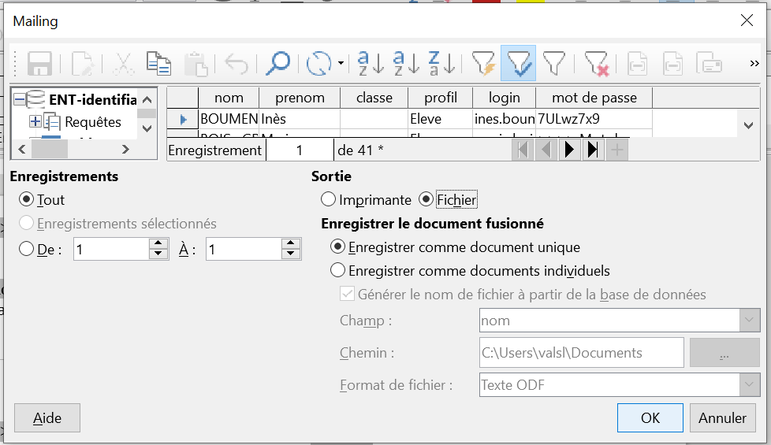

# Génération des étiquettes login/mot de passe pour les élèves et parents du lycée Emmanuel Mounier

|Révision|Date|Modification|Auteur|
|-----|-----|-----|-----|
|1.0|30/08/2019|Création|Valentin MEZIN (valentin.mezin@posteo.net)|

**Description :** au début de l'année scolaire (et parfois en milieu d'année) il est nécessaire de générer des étiquettes à imprimer et à distribuer aux élèves/parents/professeurs pour qu'ils aient leurs codes de connexion; que ce soit à l'ENT/Pronote ou aux PCs dans les salles informatique.

___
**Note : Tous les exemples prendront pour exemple la création d'étiquettes pour les identifiants ENT/Pronote.**
___

## 1. Pré-requis 

- Il sera nécessaire d'avoir les identifiants administrateur de l'ENT pour récupérer les mots de passe des élèves/parents pour accéder à l'ENT/Pronote.
 
- Il sera nécessaire d'avoir un compte référent sur le réseau pédagogique pour récupérer les mots de passes des élèves/professeurs pour accéder aux ordinateurs.
 
- Nous allons utiliser deux logiciels de la suite LibreOffice : Writer et Calc.
 

## 2. Fonctionnement

Nous allons récupérer les mots de passes (ENT/Pronote/Réseau pédagogique) sous la forme d'un fichier .csv. Un fichier .csv est comme un tableau dont les colonnes seraient séparées par un symboles et les lignes par un retour chariot. Le symbole peut être un point-virgule, une virgule, une tabulation, etc.

Nous allons transformer ce fichier .csv en tableau .ods. Nous allons nettoyer le tableau de toutes les informations non-nécessaires.

Nous allons créer un modèle d'étiquette avec Writer. Sur chaque étiquette il y aura un enregistrement différent qui provient du tableau .ods. Chaque étiquette sera unique.

Nous allons générer les étiquettes sous la forme la plus pertinente : impression directe ou .pdf.

## 3. Préparation de la base de données

Se connecter à l'ENT avec les identifiants administrateur.
Aller dans la rubrique **Annuaire*. Dans le menu **Administration* et *Fichier des identifiants*. Cliquez sur Valider, un fichier .csv sera généré. Téléchargez-le.

Ouvrez le fichier .csv avec LibreOffice Calc. Vous pouvez supprimez toutes les colonnes qui ne nous intéressent pas, et ne garder que :
- nom
- prénom
- profil
- login
- mot de passe
- classe
- nom élève (si tuteur)
- prénom élève (si tuteur)

Enregistrez le fichier en .ods.
	
## 4. Création des étiquettes

Le fichier des étiquettes pour l'année 2019-2020 existe, il vous suffit de le reprendre. Si vous voulez créer le vôtre, suivez ces étapes.

Choisissez une marque et un type de modèle si vous le connaissez. Sinon calculez vous-même la planche que vous cherchez à avoir (lignes, colonnes, marges) en modifiant l'onglet *Format*. N'oubliez pas d'enregistrer votre modèle personnalisé, c'est fastidieux de tout refaire.

Créer un *nouveau document*.

Dans mon exemple j'ai une planche de 5 lignes et de 2 colonnes d'étiquettes sur une feuille A4. 10 étiquettes en tout.

Vous remarquerez le bouton *Synchroniser les étiquettes* qui apparaît maintenant sur le document. La première étiquette en haut à gauche et considérée comme le "master". Il ne faut modifier que cette étiquette. En cliquant sur *Synchroniser les étiquettes*, toutes les autres étiquettes vont se calquer sur l'étiquette "master".

On va récupérer notre base de données et commencer à insérer nos champs dynamiques (reliés à la base de données).

Cliquez sur *Champ de mailing* puis *Parcourir*. Choisissez le fichier .ods que nous avons créé tout à l'heure.

Apparaissent alors les différents champs (colonnes) disponibles. Il suffit dès à présent de double-cliquer sur les champs qui nous intéressent. Ils apparaitront sur l'étiquette "master" sous la forme `<nom>`, `<prénom>`, etc. A la génération des étiquettes, les vraies valeurs apparaitront.

Pour l'instant si nous générons les étiquettes, il y aura autant de page que d'enregistrements. Et sur chaque page, les étiquettes seront identiques. Nous voulons que les étiquettes soient uniques.
Il faut dire au logiciel de passer à l'enregistrement suivant.

Pour ce faire nous allons rajouter une variable à la fin de chaque étiquette. *Insertion*, *Champ*, *Autres champs*. Double-cliquez sur *Enregistrement suivant*.

La variable apparaît sous la forme d'une tabulation grisée.

Mettez en page comme vous voulez l'étiquette "master" et cliquez sur *Synchroniser les étiquettes*.

Nous allons maintenant décider de quels enregistrement précisément nous voulons. Vous l'avez peut-être remarqué, le fichier des identifiants comporte aussi bien ceux des élèves que des parents. Pourtant nous aimerions pouvoir imprimer un lot que d'élèves, et un autre lot que de parents.

Commencez par faire apparaitre l'onglet de base de données. *Affichage* > *Source de données* ou Ctrl+Maj+F4.

La base de données apparait. Ce qui apparait correspond à ce qui sera généré, ni plus ni moins. Nous allons n'afficher que les élèves.

Cliquez sur le bouton de filtre et rentrer votre condition; ici nous choisissons de n'afficher que les lignes dont la colonne *profil* égale à *Eleve*.

Note : vous pouvez aussi définir une condition pour que le champ *classe* ne soit pas vide, ce qui signifie que l'élève est bien inscrit au lycée.

D'autres types de filtrage sont possible (tri alphabétique par exemple).

Désormais il ne nous reste plus qu'à générer nos étiquettes. Nous allons créer un fichier .pdf pour plus de praticité.
Cliquez sur le bouton d'impression, acceptez le message qui dit d'imprimer une lettre formulaire.

Choisissez en Sortie un *Fichier* en *Document unique*. Cliquez sur OK. Définissez le type du fichier comme un .pdf, renommez-le, enregistrez.

LibreOffice Writer génère le .pdf.

Enjoy.
